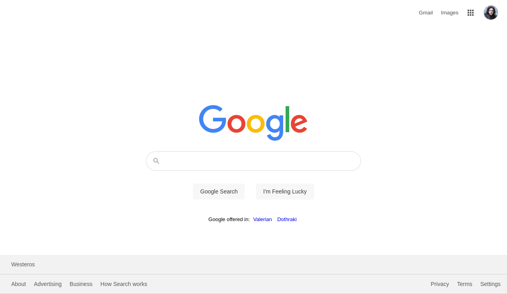
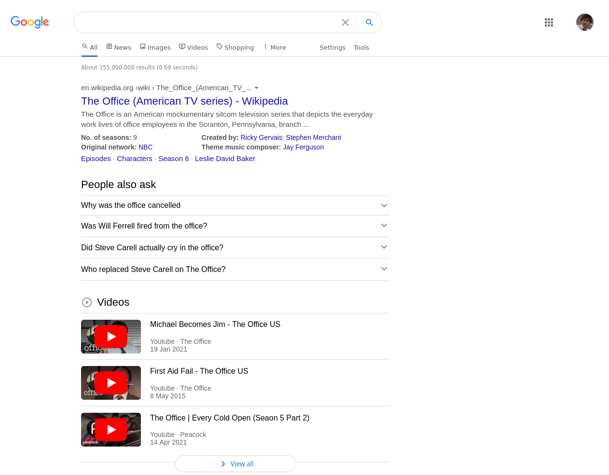

# The Odin Project

## Project: Google Homepage

**Live version** of the project can be found [here](https://renchester.github.io/TOP-Google-Homepage/)

This is an HTML and CSS test project to exercise skills in creating simple webpages and applying the lessons throughout the HTML and CSS foundations course. The result is a copy of the Google homepage as well as an accompanying search page.

View of the home page:

View of the search page:

